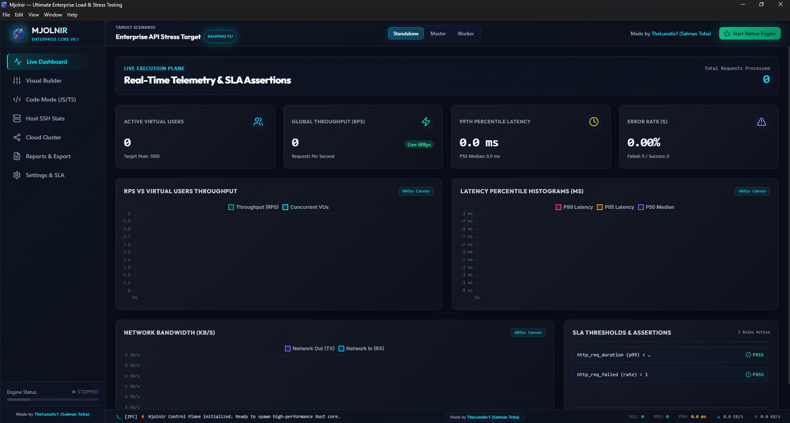

<div align="center">
  <table style="border: none;">
    <tr style="border: none;">
      <td align="center" valign="middle" style="border: none; padding: 0 20px 0 0;">
        <a href="https://github.com/TheLunatic1/Mjolnir">
          
        </a>
      </td>
      <td align="left" valign="middle" style="border: none; padding: 0;">
        <h1 style="border-bottom: none; margin: 0; font-size: 38px;">Mjolnir</h1>
        <p style="margin: 6px 0 0 0; font-size: 16px;"><strong>The Ultimate Enterprise Load & Stress Testing Desktop Application</strong><br />
        <span style="color: #888;"><em>An all-in-one desktop command center built for extreme scale, speed, and visual elegance.</em></span></p>
      </td>
    </tr>
  </table>
</div>

<br />

<div align="center">
  
</div>

---

## 🚀 Overview

**Mjolnir** is a state-of-the-art desktop server load and stress-testing application engineered to exceed the combined feature sets of industry-standard tools like **k6**, **Apache JMeter**, **Locust**, and **Vegeta**.

By uniting a **60 FPS React/Next.js Glassmorphism UI Control Plane** with a compiled **Rust asynchronous execution core**, Mjolnir generates **millions of requests per second** across distributed cloud clusters without freezing or slowing down your desktop interface. Whether you are validating API rate limiters, evaluating cloud auto-scaling elasticity, or uncovering slow database connection pool leaks over multi-day soak tests, Mjolnir delivers an unmatched, dark-mode-first experience.

## ✨ Features

- **⚡ Extreme Rust Native Core:** Powered by `Tokio`, `Hyper`, and `Quinn`. Executes high-concurrency HTTP/1.1, HTTP/2 multiplexing, HTTP/3 (QUIC/UDP), and persistent WebSockets with zero Garbage Collection pauses.
- **🎨 Visual Script Builder:** Design complex, multi-step API stress workflows, configure custom headers, query parameters, auth tokens, and response assertions via intuitive drag-and-drop nodes—**no coding required**.
- **💻 Advanced Code Mode (JS/TS):** Write dynamic load scripts using our embedded JavaScript runtime. Extract JWT tokens from login responses, execute conditional branching, and customize load variables on the fly inside the integrated Monaco editor.
- **📈 5 Enterprise Load Profiles:**
  - **Constant VU:** Fixed concurrency for baseline throughput testing.
  - **Ramping VU:** Stepwise ramp up/down across time stages to simulate organic traffic surges.
  - **Constant Arrival Rate:** Target exact RPS guarantees for API rate-limiter stress testing.
  - **Spike Testing:** Instant traffic bursts to evaluate system elasticity and crash recovery.
  - **Soak Testing:** Multi-hour/day endurance testing to identify memory leaks and DB exhaustion.
- **🖥️ Remote SSH Host Monitoring:** Connect directly to your target Linux/Unix backend server over SSH. Correlate live CPU utilization, Memory consumption, Load Average, Disk I/O, and Network interface bandwidth simultaneously alongside your stress histograms.
- **🌐 Distributed Cloud Cluster:** Switch seamlessly between Standalone desktop testing, Master orchestration, and remote Worker daemon nodes to generate massive, multi-region cloud traffic.
- **📡 Observability Exporters:** Stream sub-second latency percentiles (P50, P90, P95, P99) and error breakdowns directly into **InfluxDB v2** and **Datadog DogStatsD**.
- **📊 Live 60 FPS Visualizations:** Hardware-accelerated SVG and `uPlot` canvas charts tracking real-time requests per second, active virtual users, network bandwidth, and quantile latencies.

## 📥 Download & Install

Getting started with Mjolnir is fast and simple—no dependency compilation or CLI configuration required when using pre-built releases!

1. **Download the Latest Release:**
   Visit the official [GitHub Releases](https://github.com/TheLunatic1/Mjolnir/releases/latest) page and download the package for your operating system:
   - **Windows:** Download `Mjolnir-Setup-x.x.x.exe` *(Recommended)* or the standalone portable executable `Mjolnir-Portable-x.x.x.exe`.
   - **Linux:** Download `Mjolnir-x.x.x.AppImage` or `.deb`.
   - **macOS:** Download `Mjolnir-x.x.x.dmg` or `.zip`.

2. **Run Mjolnir:**
   Launch the application and immediately start designing your stress scenarios or connecting to your cloud cluster!

> [!NOTE]
> **Important Note for Windows Users (Microsoft Defender SmartScreen):**
> Because Mjolnir is an open-source application built without a paid corporate code-signing certificate, Windows Defender SmartScreen may display a *"Windows protected your PC"* popup when launching the installer or updating.
> 
> To proceed safely, simply click **More info** (under the text) → then click **Run anyway**. Mjolnir is 100% clean, transparent, and open-source!

## 🛠 Tech Stack

Mjolnir is engineered using a robust, hybrid desktop and systems technology stack:

- **Framework:** [Electron](https://www.electronjs.org/) for high-performance cross-platform desktop management.
- **Frontend UI:** [React 18](https://reactjs.org/) + [Vite](https://vitejs.dev/) for lightning-fast rendering and reactive state orchestration.
- **Styling:** [Tailwind CSS](https://tailwindcss.com/) featuring a curated dark-mode glassmorphism design system with custom HSL tokens and neon glows.
- **Execution Engine:** Compiled **Rust** binary (`mjolnir-engine`) utilizing `tokio` asynchronous runtimes, `hyper` HTTP libraries, and `quinn` QUIC transports.
- **Charts & Visualization:** `uPlot` canvas renderer for sub-millisecond data charting at 60 FPS.
- **Scripting:** Built-in Monaco Editor and embedded JavaScript execution runtime.
- **Host Telemetry:** Native `ssh2` client for real-time Linux infrastructure monitoring.

## 🛠 Building from Source (For Developers)

If you would like to contribute or run Mjolnir locally from source code:

```bash
# 1. Clone the repository
git clone https://github.com/TheLunatic1/Mjolnir.git
cd Mjolnir

# 2. Install workspace dependencies
npx -y pnpm@latest install

# 3. Compile the native Rust stress engine
npm run build:engine

# 4. Start the full development workspace (Vite + Electron + Engine)
npm run dev
```

## 🎨 UI & Aesthetics
Mjolnir was designed from the ground up to feel premium, futuristic, and state-of-the-art. We discarded generic, boring form layouts in favor of a **Dark Mode First** aesthetic featuring vibrant cyan and primary accents, subtle micro-animations, glowing glassmorphic panels, and responsive hover interactions. The goal is to make enterprise load testing not just a routine QA check, but an exhilarating experience.

## 📖 Complete Operational Handbook

For exhaustive instructions on designing visual pipelines, writing TypeScript load scripts, configuring cloud clusters, setting up InfluxDB exporters, and interpreting P99 latency charts, refer to our comprehensive user handbook:

👉 **[Read the Mjolnir Operational Handbook (HANDBOOK.md)](./HANDBOOK.md)** 👈

## 🤝 Contributing
Contributions, issues, and feature requests are welcome! Feel free to check the [issues page](https://github.com/TheLunatic1/Mjolnir/issues) if you want to contribute or report a bug.

## 📄 License
This project is licensed under the Apache License 2.0 - see the [LICENSE](LICENSE) file for details. 
Please note the attribution requirements specified in the [NOTICE](NOTICE) file.

### ⚠️ Attribution Requirement
As per Section 4(d) of the Apache License 2.0, any derivative works, redistributions, or forks of this software **MUST** include a prominent attribution to **"TheLunatic1 (Salman Toha)"**. Furthermore, if the software includes a user interface, this attribution must remain visibly displayed within the application's graphical user interface in a non-obtrusive manner. This attribution MUST include a hyperlink or direct reference to the original author's GitHub profile: [https://github.com/TheLunatic1](https://github.com/TheLunatic1).

---
<div align="center">
  <p>Made by <a href="https://github.com/TheLunatic1">TheLunatic1 (Salman Toha)</a></p>
</div>
